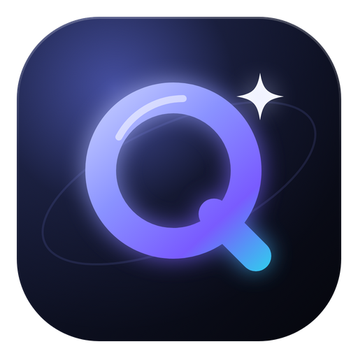
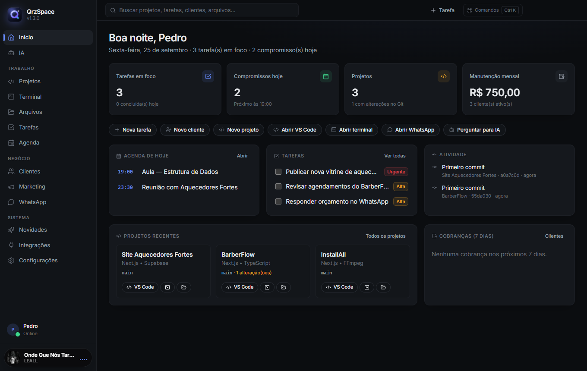
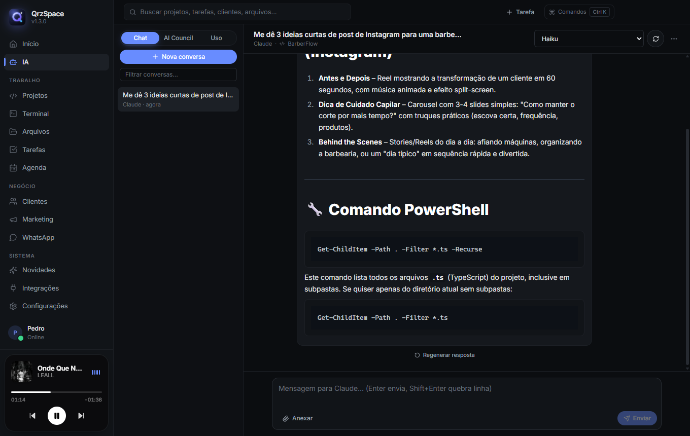
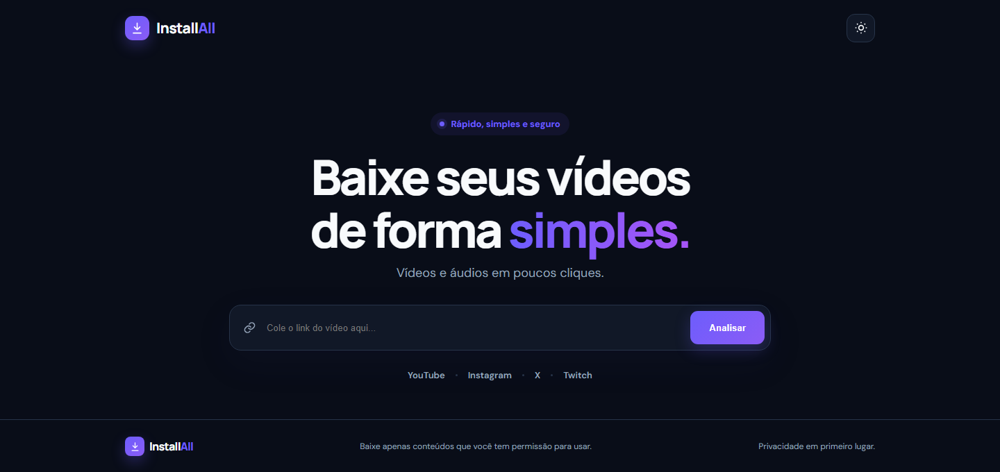
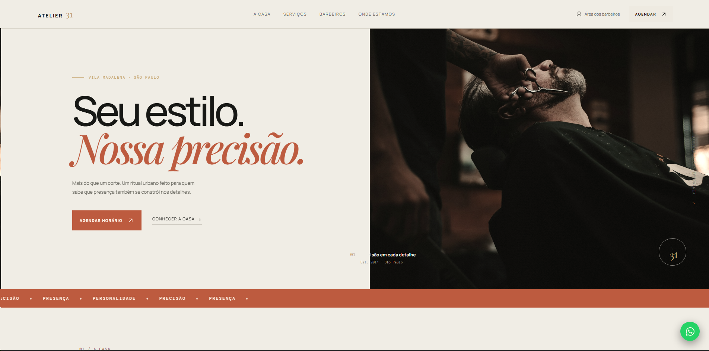
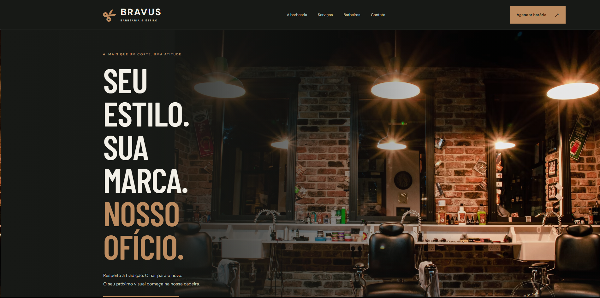
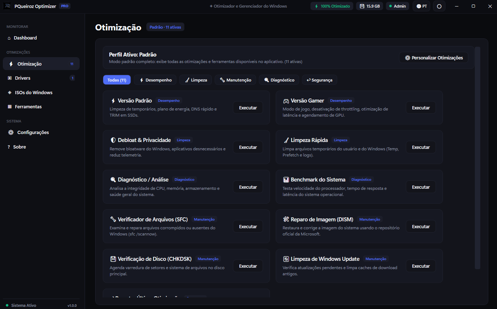

  

  
  
  

## Sobre mim

Sou **Pedro Queiroz**, desenvolvedor front-end e estudante de **Ciência da Computação no Senac**, em São Paulo.

Crio **sites, sistemas web, apps desktop e automações** — com cuidado com a experiência de uso, a organização do código e os detalhes visuais. Hoje trabalho como desenvolvedor na **Aquecedores Fortes** e atendo projetos próprios e de clientes.

- 🚀 Construindo agora: **QrzSpace**, minha central de trabalho desktop com IA
- 🎓 Ciência da Computação · Senac (2026–2030)
- 💬 Aberto a projetos de sites, sistemas e automações

## Tecnologias

   
  

## Projeto em destaque

<table>
  <tr>
    <td width="96" valign="top"></td>
    <td valign="top">
      <h3>QrzSpace</h3>
      Central de trabalho desktop para devs e freelancers: projetos, tarefas, clientes, agenda, marketing, terminal, arquivos e IA num só lugar — abrindo VS Code, terminal e GitHub em um clique.
        
      <b>Electron · React · TypeScript · SQLite · Tailwind</b>
    </td>
  </tr>
</table>

  
  

- 🤖 **IA integrada**: chat e *AI Council* (Claude, ChatGPT e Gemini lado a lado) — por API key ou pela própria assinatura, via Claude Code e Codex
- 🔒 **Segurança em primeiro lugar**: a IA nunca executa nada sozinha, comandos pedem permissão, segredos ficam no cofre do Windows e o acesso a arquivos é limitado às pastas autorizadas
- 🎵 **Mini player** estilo *Dynamic Island* com a música do Spotify, **Discord Rich Presence**, GitHub, Google Agenda e WhatsApp
- 🎨 5 temas, interface em **português e inglês**, animações com *motion* e **atualização automática**
- ✅ 190 testes automatizados + testes de ponta a ponta pela interface

  <a href="https://github.com/PQueirozDev/QrzSpace-releases/releases/latest"><b>⬇ Baixar para Windows</b></a> · código-fonte privado

## Outros projetos

<table>
  <tr>
    <td width="50%" valign="top">
      
      <h4><a href="https://github.com/PQueirozDev/InstallAll">InstallAll</a></h4>
      Downloader de mídia pública com prévia, escolha de formato e progresso em tempo real. 
      <b>Next.js · TypeScript · Node.js · FFmpeg</b> 
      <a href="https://installall.vercel.app">Ver aplicação ↗</a>
    </td>
    <td width="50%" valign="top">
      
      <h4><a href="https://github.com/PQueirozDev/atelier-31-barbearia">Atelier 31</a></h4>
      Site de barbearia com interface em React e integração com Supabase. 
      <b>React · TypeScript · Vite · Supabase</b> 
      <a href="https://atelier-31-barbearia.vercel.app">Ver aplicação ↗</a>
    </td>
  </tr>
  <tr>
    <td width="50%" valign="top">
      
      <h4><a href="https://github.com/PQueirozDev/bravus-barbearia">Bravus Barbearia</a></h4>
      Landing page responsiva com simulação de agendamento. 
      <b>HTML · CSS · JavaScript</b> 
      <a href="https://pqueirozdev.github.io/bravus-barbearia/">Ver site ↗</a>
    </td>
    <td width="50%" valign="top">
      
      <h4>PQueiroz Optimizer PRO</h4>
      Otimizador do Windows com perfis gamer e diário, limpeza, diagnósticos e manutenção (SFC, DISM, CHKDSK). 
      <b>C# · .NET · Windows</b> 
      <a href="https://site-mu-six-24.vercel.app">Ver site ↗</a>
    </td>
  </tr>
</table>

## Trajetória

| Quando | Onde | O quê |
| :-- | :-- | :-- |
| 2026 → hoje | **Aquecedores Fortes** | Desenvolvedor Front-end Júnior — sistemas web internos e site |
| 2025 → 2026 | **Freelancer** | Sites, landing pages, bots e automações para pequenos negócios |
| 2026 → 2030 | **Senac Santo Amaro** | Ciência da Computação (em andamento) |

---

  Tem um projeto em mente? <a href="mailto:pedrohenriqueiroz158@gmail.com"><b>Vamos conversar ✦</b></a>

