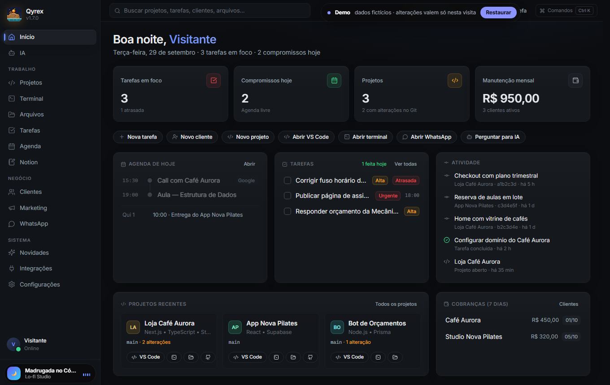
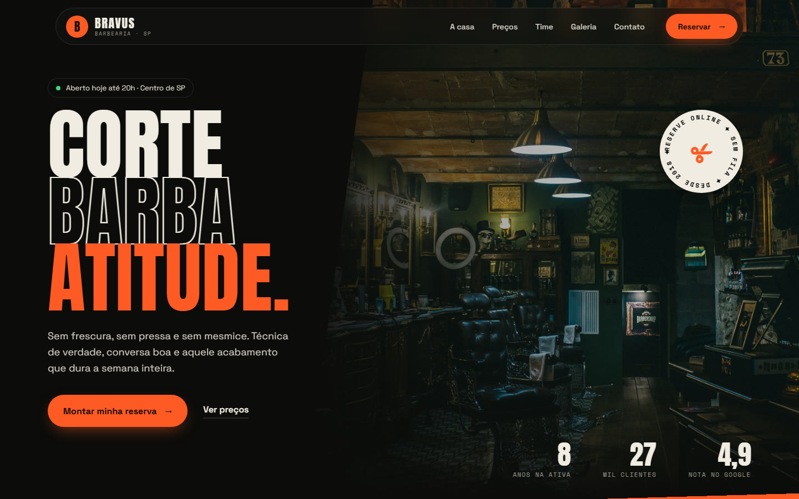
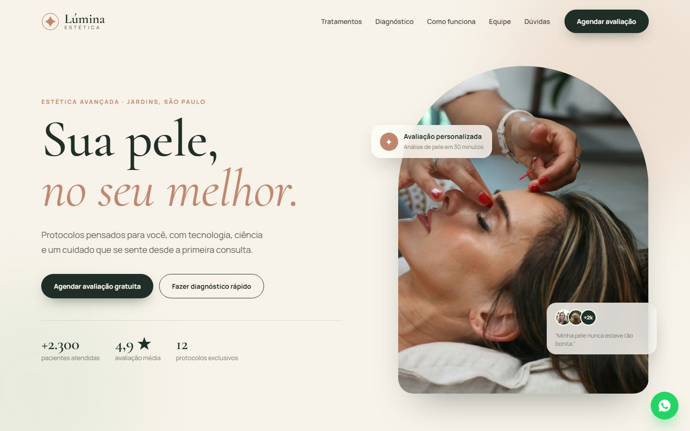
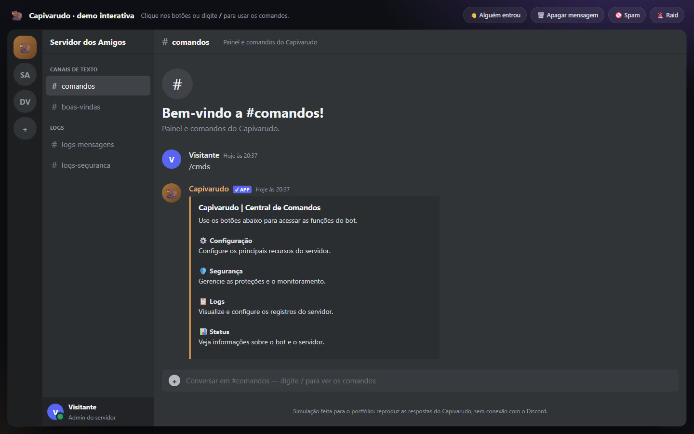
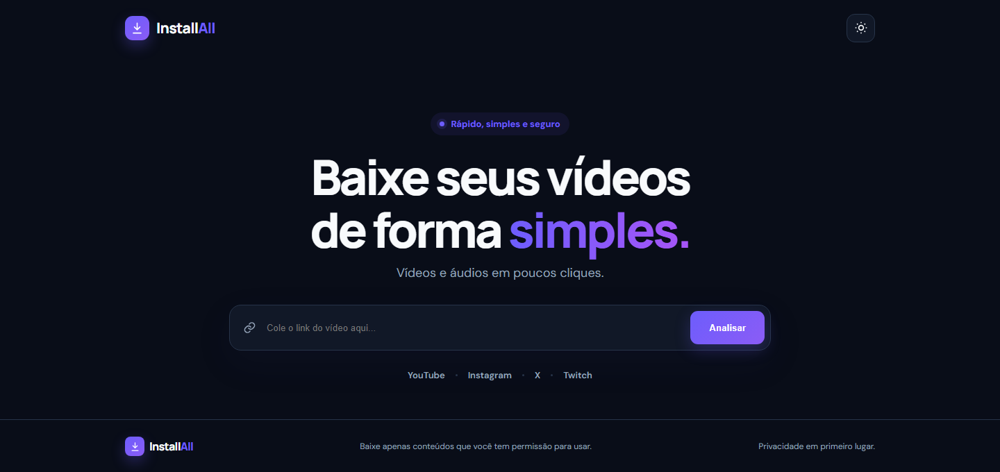
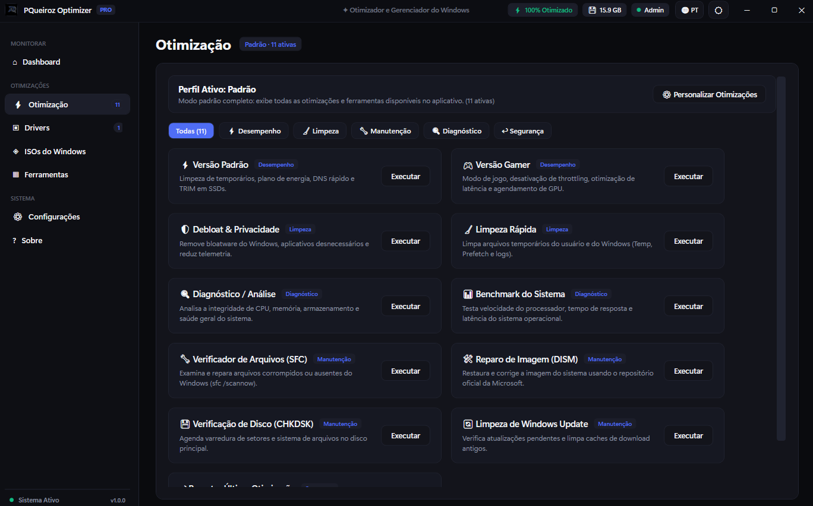

  

  
  

## Sobre mim

Sou **Pedro Queiroz**, desenvolvedor front-end e estudante de **Ciência da Computação no Senac**, em São Paulo.

Crio **sites, sistemas web, apps desktop e automações** — com cuidado com a experiência de uso, a organização do código e os detalhes visuais. Hoje trabalho como desenvolvedor na **Aquecedores Fortes** e atendo projetos próprios e de clientes.

- 🚀 Construindo agora: **[Qyrex](https://github.com/PQueirozDev/Qyrex)**, minha central de trabalho desktop com IA, agora open source
- 🎓 Ciência da Computação · Senac (2026–2030)
- 💬 Aberto a projetos de sites, sistemas e automações

## Tecnologias

   
  

## Projeto em destaque

<table>
  <tr>
    <td width="96" valign="top"></td>
    <td valign="top">
      <h3><a href="https://qyrexapp.vercel.app">Qyrex</a></h3>
      Central de trabalho desktop para devs e freelancers: projetos, tarefas, clientes, agenda, marketing, terminal, arquivos e IA num só lugar — abrindo VS Code, terminal e GitHub em um clique.
        
      <b>Electron · React · TypeScript · SQLite · Tailwind · open source (MIT)</b>
        
      <a href="https://qyrexapp.vercel.app">Site</a> · <a href="https://github.com/PQueirozDev/Qyrex">Código</a> · <a href="https://github.com/PQueirozDev/QrzSpace-releases/releases/latest">Download para Windows</a> · <a href="https://pqueiroz.vercel.app/qyrex-demo/">Demo no navegador</a>
    </td>
  </tr>
</table>

  
  

- 🤖 **IA integrada**: chat e *AI Council* (Claude, ChatGPT e Gemini lado a lado) — por API key ou pela própria assinatura, via Claude Code e Codex
- 🔒 **Segurança em primeiro lugar**: a IA nunca executa nada sozinha, comandos pedem permissão, segredos ficam no cofre do Windows e o acesso a arquivos é limitado às pastas autorizadas
- 🎵 **Mini player** estilo *Dynamic Island* com a música do Spotify, **Discord Rich Presence**, GitHub, Google Agenda e WhatsApp
- 🎨 5 temas, interface em **português e inglês**, animações com *motion* e **atualização automática**
- ✅ 208 testes automatizados + testes de ponta a ponta pela interface

## Outros projetos

<table>
  <tr>
    <td width="33%" valign="top">
      
      <h4><a href="https://github.com/PQueirozDev/atelier-31-barbearia">Atelier 31</a></h4>
      Barbearia com agendamento online real, escolha de barbeiro e área da equipe. 
      <b>React · TypeScript · Supabase</b> 
      <a href="https://atelier-31-barbearia.vercel.app">Ver site ↗</a>
    </td>
    <td width="33%" valign="top">
      
      <h4><a href="https://github.com/PQueirozDev/bravus-barbearia">Bravus Barbearia</a></h4>
      Identidade street, tabela de preços interativa e reserva pelo WhatsApp. 
      <b>HTML · CSS · JavaScript</b> 
      <a href="https://pqueirozdev.github.io/bravus-barbearia/">Ver site ↗</a>
    </td>
    <td width="33%" valign="top">
      
      <h4><a href="https://github.com/PQueirozDev/lumina-estetica">Lúmina Estética</a></h4>
      Clínica de estética com diagnóstico interativo e agendamento. 
      <b>HTML · CSS · JavaScript</b> 
      <a href="https://pqueirozdev.github.io/lumina-estetica/">Ver site ↗</a>
    </td>
  </tr>
  <tr>
    <td width="33%" valign="top">
      
      <h4><a href="https://github.com/PQueirozDev/Bot-Normermo">Capivarudo</a></h4>
      Bot de segurança para Discord: painel, logs, anti-spam e anti-raid. 
      <b>TypeScript · discord.js · Prisma</b> 
      <a href="https://pqueiroz.vercel.app/capivarudo-demo.html">Testar demo ↗</a>
    </td>
    <td width="33%" valign="top">
      
      <h4><a href="https://github.com/PQueirozDev/InstallAll">InstallAll</a></h4>
      Downloader de mídia pública com prévia e progresso em tempo real. 
      <b>Next.js · TypeScript · FFmpeg</b> 
      <a href="https://installall.vercel.app">Ver aplicação ↗</a>
    </td>
    <td width="33%" valign="top">
      
      <h4>PQueiroz Optimizer PRO</h4>
      Otimizador do Windows com perfis, limpeza e diagnósticos. 
      <b>C# · .NET · Windows</b> 
      <a href="https://site-mu-six-24.vercel.app">Ver site ↗</a>
    </td>
  </tr>
</table>

## Trajetória

| Quando | Onde | O quê |
| :-- | :-- | :-- |
| 2026 → hoje | **Aquecedores Fortes** | Desenvolvedor Front-end Júnior — sistemas web internos e site |
| 2025 → 2026 | **Freelancer** | Sites, landing pages, bots e automações para pequenos negócios |
| 2026 → 2030 | **Senac Santo Amaro** | Ciência da Computação (em andamento) |

---

  Tem um projeto em mente? <a href="mailto:pedrohenriqueiroz158@gmail.com"><b>Vamos conversar ✦</b></a>

